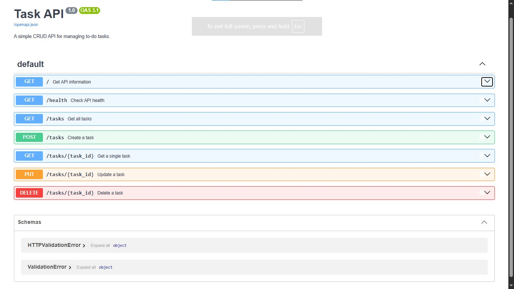

#  Task API

A simple RESTful CRUD API for managing a to-do list, built with **Python** and **FastAPI**.

This project was built as part of **Week 2 — Assignment 1: Build Your First CRUD API**.

---

##  Overview

The Task API allows clients to create, read, update, and delete tasks using standard HTTP methods.

The API uses an **in-memory list** to store tasks, so no database is required. Data is intentionally lost whenever the server restarts.

### CRUD Operations

| Operation | HTTP Method | Endpoint           | Description             |
| --------- | ----------- | ------------------ | ----------------------- |
| Create    | `POST`      | `/tasks`           | Create a new task       |
| Read      | `GET`       | `/tasks`           | Get all tasks           |
| Read      | `GET`       | `/tasks/{task_id}` | Get a single task       |
| Update    | `PUT`       | `/tasks/{task_id}` | Update an existing task |
| Delete    | `DELETE`    | `/tasks/{task_id}` | Delete a task           |

---

##  Technologies

* **Python 3.10+**
* **FastAPI**
* **Uvicorn**
* **Swagger UI / OpenAPI**
* **Git & GitHub**

---

## Project Structure

```text
todo-api/
│
├── main.py          # FastAPI application and CRUD logic
├── README.md        # Project documentation
├── .gitignore       # Ignored files and folders
└── venv/            # Python virtual environment
```

---

## Installation

### 1. Clone the repository

```bash
git clone https://github.com/nooragab/todo-api.git
cd todo-api
```

### 2. Create a virtual environment

```bash
python -m venv venv
```

### 3. Activate the virtual environment

**Windows PowerShell:**

```powershell
.\venv\Scripts\Activate.ps1
```

### 4. Install dependencies

```bash
pip install fastapi uvicorn
```

---

## Run the API

Start the server with:

```bash
uvicorn main:app --reload --port 8000
```

The API will be available at:

```text
http://127.0.0.1:8000
```

---

## Swagger UI

FastAPI automatically generates interactive API documentation using Swagger UI.

Open:

```text
http://127.0.0.1:8000/docs
```

From Swagger UI, you can test the complete CRUD cycle using the **Try it out** button.

---

## API Endpoints

### `GET /`

Returns basic information about the API.

**Response:**

```json
{
  "name": "Task API",
  "version": "1.0",
  "endpoints": ["/tasks"]
}
```

---

### `GET /health`

Checks whether the API is running.

**Response:**

```json
{
  "status": "ok"
}
```

---

### `GET /tasks`

Returns all tasks.

**Response:**

```json
[
  {
    "id": 1,
    "title": "Buy milk",
    "done": false
  },
  {
    "id": 2,
    "title": "Read a book",
    "done": true
  },
  {
    "id": 3,
    "title": "Clean the house",
    "done": false
  }
]
```

---

### `GET /tasks/{task_id}`

Returns a single task using its ID.

**Example:**

```text
GET /tasks/1
```

**Response:**

```json
{
  "id": 1,
  "title": "Buy milk",
  "done": false
}
```

If the task does not exist, the API returns:

```text
404 Not Found
```

with an error message.

---

### `POST /tasks`

Creates a new task.

**Request body:**

```json
{
  "title": "Learn FastAPI"
}
```

The API automatically:

* Assigns the next available ID.
* Sets `done` to `false`.
* Adds the task to the in-memory list.

**Response status:**

```text
201 Created
```

**Response body:**

```json
{
  "id": 4,
  "title": "Learn FastAPI",
  "done": false
}
```

If the title is missing or empty, the API returns:

```text
400 Bad Request
```

---

### `PUT /tasks/{task_id}`

Updates an existing task.

**Example:**

```text
PUT /tasks/1
```

**Request body:**

```json
{
  "title": "Buy chocolate",
  "done": true
}
```

**Response:**

```json
{
  "id": 1,
  "title": "Buy chocolate",
  "done": true
}
```

The API returns:

* `200 OK` — task updated successfully.
* `400 Bad Request` — invalid or empty request body.
* `404 Not Found` — task does not exist.

---

### `DELETE /tasks/{task_id}`

Deletes a task using its ID.

**Example:**

```text
DELETE /tasks/3
```

Successful deletion returns:

```text
204 No Content
```

If the task does not exist:

```text
404 Not Found
```

---

## Testing with cURL

### Create a task

```bash
curl -i -X POST http://localhost:8000/tasks -H "Content-Type: application/json" -d "{\"title\":\"Buy milk\"}"
```

Example output:

```text
HTTP/1.1 201 Created
content-type: application/json
```

```json
{
  "id": 4,
  "title": "Buy milk",
  "done": false
}
```

### Get all tasks

```bash
curl -i http://localhost:8000/tasks
```

### Get one task

```bash
curl -i http://localhost:8000/tasks/1
```

### Update a task

```bash
curl -i -X PUT http://localhost:8000/tasks/1 -H "Content-Type: application/json" -d "{\"title\":\"Buy chocolate\",\"done\":true}"
```

### Delete a task

```bash
curl -i -X DELETE http://localhost:8000/tasks/3
```

---

## Error Handling

The API uses HTTP status codes to clearly communicate the result of each request.

| Status Code       | Meaning                        |
| ----------------- | ------------------------------ |
| `200 OK`          | Request completed successfully |
| `201 Created`     | A new task was created         |
| `204 No Content`  | Task was successfully deleted  |
| `400 Bad Request` | Invalid or missing input       |
| `404 Not Found`   | Requested task does not exist  |

---

## Data Storage

This project intentionally uses **in-memory storage** instead of a database.

Tasks are stored in a Python list:

```python
tasks = [
    {"id": 1, "title": "Buy milk", "done": False},
    {"id": 2, "title": "Read a book", "done": True},
    {"id": 3, "title": "Clean the house", "done": False}
]
```

Because the data is stored only in memory, **all tasks are lost when the server restarts**.

This is intentional and demonstrates the difference between temporary in-memory data and persistent database storage.

---

## Swagger UI

The project includes interactive Swagger UI documentation provided automatically by FastAPI.

Open:

```text
http://127.0.0.1:8000/docs
```

### Swagger Screenshot




---

## Project Requirements Checklist

* [x] Server runs on localhost with one command
* [x] `GET /tasks`
* [x] `GET /tasks/{task_id}`
* [x] `POST /tasks`
* [x] `PUT /tasks/{task_id}`
* [x] `DELETE /tasks/{task_id}`
* [x] Correct HTTP status codes
* [x] Input validation for POST and PUT
* [x] 404 handling for unknown tasks
* [x] Swagger UI at `/docs`
* [x] In-memory task storage
* [x] Git version history
* [x] Public GitHub repository
* [x] README documentation

---

## What I Learned

Through this project, I practiced:

* Building a REST API with FastAPI.
* Understanding CRUD operations.
* Working with HTTP methods and status codes.
* Handling path parameters.
* Validating client input.
* Working with request and response data.
* Testing APIs through Swagger UI.
* Using Git for version control.
* Publishing a backend project to GitHub.
